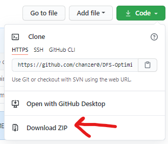
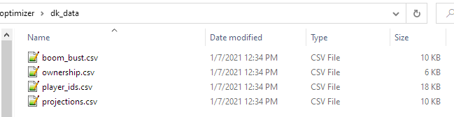
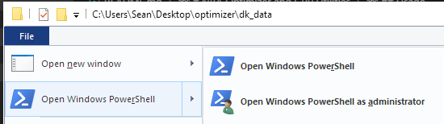
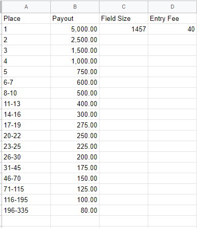
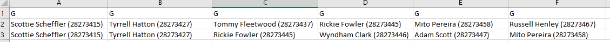
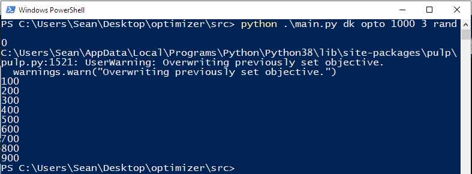
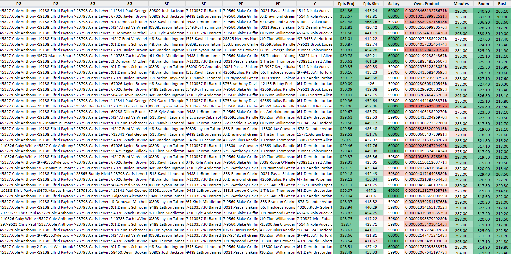
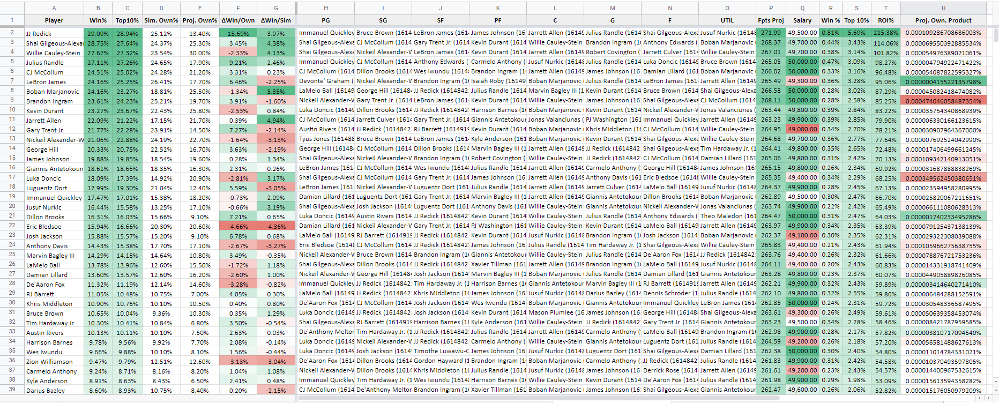

# NFL-DFS-Tools

Packaged in this repository is an NFL Optimizer and GPP Simulator for DraftKings (with FanDuel on the way), along with other tools you might find useful in helping you win your Cash games, Head-to-heads and Tournaments. You'll find installation and usage instructions below. If at any time you have an issue and want help, or want to discuss strategies with other users, you can [join our discord here.](https://discord.gg/ThVAYfVuzU)

This tool was created in conjunction with [@bjungwirth](https://github.com/bjungwirth) who is knowledgeable in both DFS game theory as well advanced python data science and data strucures. You can check him out on [Twitter](https://twitter.com/blainejungwirth?lang=en) or read [his blog.](http://http://jungwirb.io/)

## Installation

If you're lazy and don't like reading, you can check this video which covers _most_ everything listed below. Note that this video concerns our NBA-DFS-Tools repo, so treat this README as gospel.
[](https://www.youtube.com/watch?v=5r3_n9qrZ0Y "NBA-DFS-Tools Installation and Usage Guide")

### System requirements

-   To run the tools, you will need to [install python](https://www.python.org/downloads/) if you don't already have it. These tools were bult on Python >=3.8.2, and may be incompatible with outdated versions of Python.
-   In addition to the base python installation, you will need the following packages:
    -   [PuLP](https://pypi.org/project/PuLP/) - `pip install pulp`. This is the linear programming solver - the "optimizer" if you will.
    -   [timedelta](https://pypi.org/project/timedelta/) - `pip install timedelta`. This package makes it easy to interpret dates for late swaptimizing lineups.
    -   [pytz](https://pypi.org/project/pytz/) - `pip install pytz`. Another helpful package for interpreting dates and late swaptimizing
    -   [numpy](https://pypi.org/project/numpy/) - `pip install numpy`. This package makes data manipulation and handling matrices easier.
    -   [pandas](https://pypi.org/project/pandas/) - `pip install pandas`. This package converts pythonic data structures (dicts, lists, etc) to more familiar tabular data structures.

To install these tools, you may either clone this repository or download the repository as a ZIP file (see image below) and extract it to the directory of your choosing.



After you have cloned or downloaded the code base, you must import player contest data from DraftKings or FanDuel. Reference the screenshots below for your relative site. You will need to rename these files to `player_ids.csv`, and place into their relative directory (`dk_data/` or `fd_data/`). These directories should be folders located in the same directory as `src/` and `output/`, and will hold relevant data for each site.

After you have the player data, you must import data from Awesemo, namely the projections, ownership, boom/bust tool. Download them as CSV, and rename them to match the image below. These will go in either `dk_data/` or `fd_data/` depending on which data you downloaded.



## Usage

To use the tools, you will need to open a windows console or powershell terminal in the same directory as this repository. To do this, go to the root directory and then navigate to `File > Open Windows Powershell` as seen below.



To run the tools, the generic usage template is as follows:
`python .\main.py <site> <process> <num_lineups> <num_uniques>`

Where:
`<site>` is:

-   `dk` for DraftKings. Note for DraftKings, if you run into any KeyErrors on player names (e.g. Matthew Fitzpatrick vs Matt Fitzpatrick) you must also run `python .\name_change.py` before any crunching/simulating, as some player names differ between projections and DraftKings's player data
-   `fd` for FanDuel. Note for FanDuel, you must also run `python .\name_change.py` before any crunching, as some player names differ between projections and FanDuel's player data

`<process>` is:

-   `opto` for running optimal lineup crunches, with or without randomness
-   `sim` for running GPP simulations

    -   Usage #1 allows you to run arbitrary simulations for any field size and number of iterations, without regards to a real contest structure. The usage for this is: `python .\main.py <site> sim <field_size> <num_iterations>`, where `<field_size>` is the known entrant size, `<num_iterations>` is the number of times you wish to simulate the tournament.

    -   Usage #2 allows you to specify an actual DraftKings contest, which will dictate `<field_size>`. You will specify the number of iterations, but specifying the contest allows the simulation to take ROI into account, since the payout structure and entry fee is known. The usage for this is: `python .\main.py <site> sim cid <num_iterations> <match>`. To execute this usage, you will need a `contest_structure.csv` file in the structure of the image shown below. You can obtain this fairly quickly by opening up the contest details overlay and copy/pasting the prize payouts section into Excel or Google sheets, then using `Ctrl+H` to get rid of 'st', 'nd', 'rd', 'th', etc...

        

        -   Additionally, you may opt to upload lineups from a file rather than have them randomly generated/simulated. To specify this option, you will add `file` as a flag in your command like so: `python .\main.py <site> sim cid file 10000`. You must have an input file called `tournament_lineups.csv` in the base input directory. This allows you to upload specifically-tailored lineups that you feel are more representative of your contest than the ones generated. It also has the added benefit of being much faster than generating lineups. For example, you may take the output of the `opto` process, and rename the file to `tournament_lineups.csv`, and use those as your input for the `sim` process. The simulator will now automatically generate the difference between the number of lineups in the `tournament_lineups.csv` file and the `<field_size>` parameter from either the `contest_structure.csv` or the shell prompt.

        The `tournament_lineups.csv` file requires six columns, one for each player in a lineup. Players can either have their full name or full name and player id in parentheses.

        

-   `sd_opto` for running showdown crunches, with or without randomness

`<num_lineups>` is the number of lineups you want to generate when using the `opto` process.

`<num_uniques>` defines the number of players that must differ from one lineup to the next. These unique constraints are applied at the time of optimization, so if you ask for 10 lineups with 5 unique players, you will get 10 lineups with 5 unique players. In the past, this was enforced post-optimization, meaning it would prune lineups from the pool if they violated the unique constraints, resulting in fewer lineups than requested.

For example, to generate 1000 lineups for DraftKings, with 3 uniques and randomness, I would execute the following:
`python .\main.py dk opto 1000 3` with `"randomness": X` in `config.json` where `X` is a number between 0 and 100

The image below shows what the shell/terminal should look like when executing this. You may safely ignore the PuLP overwriting warning, as we must overwrite the linear programming objective with the updated random projections.



## Config

In the base directory, you will find `sample.config.json`, which has a few template options for you to limit players from teams, and make groups of players you want a limit on. This is just meant to show you how you structure rules in this optimizer. When you're ready, copy this file and rename it to `config.json`. Note that you cannot have comments in this file and it must be properly formatted. If you're on windows, be sure you are renaming the entire file to `config.json` and not `config.json.json`. This can happen if you don't have file name extensions visible. To fix this, in your windows file explorer, go to the "View" tab up top, and tick the box that says "File name extensions".

The structure for the config is as follows:

```
{
    "projection_path": "projections.csv", // This is where projections are loaded from -- the required columns are "Name", "Position", "Team", "Salary", "Fpts", "Own%", and "StdDev". "Ceiling" is an optional column, if not provided then it is calculated as Fpts + StdDev. "Field Fpts" is also an optional column, if provided the field generation algorithm will consider this projection when building lineups instead of "Fpts". The basic theory behind this is the field may not use the same projections as the user, so providing an 'industry' projection could make more sense to reduce bias in lineup building. If you are optimizing or simulating for Showdown, you also need a "CptOwn%" column. If it is not provided, it is calculated as half of the normal ownership.
    "player_path": "player_ids.csv", // This is where player ids are loaded from -- this is the direct player ID export from DraftKings/Fanduel found on the contest or edit lineups page.
    "contest_structure_path": "contest_structure.csv", // This is where GPP sim tournament strucure is loaded from -- as seen above, the required columns are "Place", "Payout", "Field Size", "Entry Fee"
    "use_double_te": true, // should the field lineup generator use double te lineups
    "global_team_limit": 4, // max number of players allowed on one team by the field lineup generator
    "projection_minimum": 5, // minimum player projection to use
    "randomness": 25, // percentage of a player's standard deviation to use when simulating. think of this like a global randomness adjustment (100=use player's actual projected stdev)
    "min_lineup_salary": 49200, //minimum field lineup salary to use in the field lineups generator
    "max_pct_off_optimal": 0.25, // what percentage off the optimal lineup a lineup is allowed to be in the field generator
    "num_players_vs_def" : 0, // max number of players to allow in a lineup with the opposing defense
    "pct_field_using_stacks" : 0.65, // what percentage of the field uses stacks (this number is then randomly sampled so the simulated field values may be different than this value)
    "pct_field_double_stacks": 0.4, // what percent of the field are allowed to use double stacks (QB + 2 Pass catchers)
    "default_qb_var" : 0.4, // if no stdev for a QB is supplied, this number is multiplied by the player's projection to estimate a standard deviation
    "default_skillpos_var" : 0.5, // if no stdev for a RB,WR,TE is supplied, this number is multiplied by the player's projection to estimate a standard deviation
    "default_def_var" : 0.5, // if no stdev for a DST is supplied, this number is multiplied by the player's projection to estimate a standard deviation
    "at_most": {
        "1": [["Ezekiel Elliott", "Tony Pollard"]] // A simple rule to use at most 1 of these players. Although if you wish to do this for all running backs, it's easier to create a stack rule as shown below
    },
    "at_least": {
        "1": [
            ["Patrick Mahomes"], // Use at least 1 of Pat Mahomes. This will force him in every lineup. If you are looking to make QB + WR and bringback rules, I recommend doing them in the stack rules shown below
            ["Travis Kelce"], // Use at least 1 of Travis Kelce. This will force him in every lineup.
            ["Ja'Marr Chase", "Joe Mixon", "Tee Higgins", "Tyler Boyd"] // Use at least 1 of Ja'Marr, Joe, Tee or Tyler. This will force 1 of these in every lineup.
        ]
    },
    "stack_rules": { // This is where the magic happens
        "pair": [ // "pair" rules are rules designed to stack certain positions with other positions
            {
                "key": "QB", // This "key" determines the rule is for every QB. In showdown, this refers to the CPT position. E.g. pair CPT QB with...
                "positions": ["WR", "TE"], // This field describes which positions to stack with. In this case, we want WRs and TEs. In showdown, this refers to the FLEX positions. E.g. pair CPT QB with WR, TE from the FLEX
                "count": 2, // The number of these positions to stack with the QB. In this configuration we can get QB + 2 WR, QB + 1WR&1TE, QB + 2TE (if using double tight end in the config)
                "type": "same-team", // Can be 'same-team', 'same-game', or 'opp-team'. In this configuration, we are telling the optimizer to consider only WRs and TEs from the same team as the QB.
                "exclude_teams": [] // If you don't want this rule to apply to a certain team, you can include them here. For example, ["ARI", "BAL"]
            },
            {
                "key": "QB",
                "positions": ["WR", "TE", "RB"],
                "count": 1,
                "type": "opp-team", // Since we specifying opp-team here, This rule is saying to stack a QB with at least 1 WR, TE or RB from the opposing team.
                "exclude_teams": []
            }
        ],
         "limit": [ // "limit" rules are designed to limit a position to a certain number unless paired with another position
            { // a basic limit rule, where we are limiting the number of RBs from the same team to 1
                "positions": ["RB"],
                "type": "same-team",
                "count": 1,
                "exclude_teams": []
            },
            { // a more advanced limit rule, where we are limiting the number of WRs and TEs on the same team to 1, unless we are pairing them with a QB from the same game
                "positions": ["WR", "TE"],
                "type": "same-team",
                "count": "1",
                "exclude_teams": [],
                "unless_positions": ["QB"],
                "unless_type": "same-game"
            }
        ]
    },
    "team_limits": { // self explanatory, limits a certain team to a number of players. If a team has a tough matchup or poor team total, you may want to limit your exposure to players on that team
        "DEN": 1,
        "LA": 1,
        "NO": 1,
        "NYG": 1,
        "HOU": 1,
        "TEN": 1
    },
    "matchup_limits": { // Like before, if a matchup has a low total or poor weather, you may want to limit your exposure to that game.
        "DEN@NYG": 2
    },
    "matchup_at_least": { // If a game has a high total or you feel good about the environment, you can specify a minimum number of players to include from that game.
        "BUF@NYJ": 2
    },
    "custom_correlations" : {
        "Joe Burrow": {"RB": 0.69, "WR":-0.42}
    } // the gpp simulator uses correlation numbers derived from 2020-2022 data for the entire NFL. if one so chooses they can enter their own custom correlations for specific players (e.g. you may want to boost the default correlation between Pat Mahomes and Travis Kelce) the default values by position are:
        if pos == 'QB':
            corr = {'QB': 1, 'RB': 0.08, 'WR': 0.62, 'TE': 0.32, 'DST' : -0.09, 'Opp QB': 0.24, 'Opp RB' : 0.04, 'Opp WR': 0.19, 'Opp TE' : 0.1, 'Opp DST': -0.41}
        elif pos == 'RB':
            corr = {'QB': 0.08, 'RB': 1, 'WR': -0.09, 'TE': -0.02, 'DST' : 0.07, 'Opp QB': 0.04, 'Opp RB' : -0.08, 'Opp WR': 0.01, 'Opp TE' : 0.03, 'Opp DST': -0.33}
        elif pos == 'WR':
            corr = {'QB': 0.62, 'RB': -0.09, 'WR': 1, 'TE': -0.07, 'DST' : -0.08, 'Opp QB': 0.19, 'Opp RB' : 0.01, 'Opp WR': 0.16, 'Opp TE' : 0.08, 'Opp DST': -0.22}
        elif pos == 'TE':
            corr = {'QB': 0.32, 'RB': -0.02, 'WR': -0.07, 'TE': 1, 'DST' : -0.08, 'Opp QB': 0.1, 'Opp RB' : 0.03, 'Opp WR': 0.08, 'Opp TE' : 0, 'Opp DST': -0.14}
        elif pos == 'DST':
            corr = {'QB': -0.09, 'RB': 0.07, 'WR': -0.08, 'TE': -0.08, 'DST' : 1, 'Opp QB': -0.41, 'Opp RB' : -0.33, 'Opp WR': -0.22, 'Opp TE' : -0.14, 'Opp DST': -0.27}
}
```

## Output

Data is stored in the `output/` directory. Note that subsequent runs of the tool will overwrite previous output files, so either move them or rename them if you wish to preseve them. From there, you may upload these `.csv` files into Excel, and "pretty them up" - this can be seen below

### `opto` Process



### `sim` Process



### Simulation Methodology

We assume player fantasy point distributions are [multivariate gaussian](https://en.wikipedia.org/wiki/Multivariate_normal_distribution) and create [monte carlo simulations](https://en.wikipedia.org/wiki/Monte_Carlo_method) using the provided fantasy point projections, standard deviations and player correlations. For the lineup generation process, we take the provided `tournament_lineups.csv` file (if `file` is provided as an argument in the terminal) and then sample from the provided ownership projections to fill the rest of the contest, using the field size provided in the `contest_structure.csv` file. The `max_pct_off_optimal` configuration allows the user to be specific about which generated lineups are kept and which are thrown out, based on the lineup's total projected fantasy points. Once the lineups are generated and the simulated fantasy point distributions are created, we determine the rank of each lineup for each sim and then allocate prize money based on the values provided in the `contest_structure.csv` file.

### IMPORTANT NOTES

Currently this repository only works with DraftKings MLB tournaments. FanDuel simulations will be provided at a later date.

We both come from web3/software backgrounds and we believe in the power of open source tools and collaboration. This version of our simulation modules will **always** be provided for free for all sports that we offer on GitHub.

Tips and donations are, of course, greatly appreciated:

PayPal: [](https://www.paypal.com/donate/?hosted_button_id=NALW2B8ZMTCG8)

Ethereum Address:


0x2D62C15849ddC68DDB2F9dFBC426f0bF46eaE006
